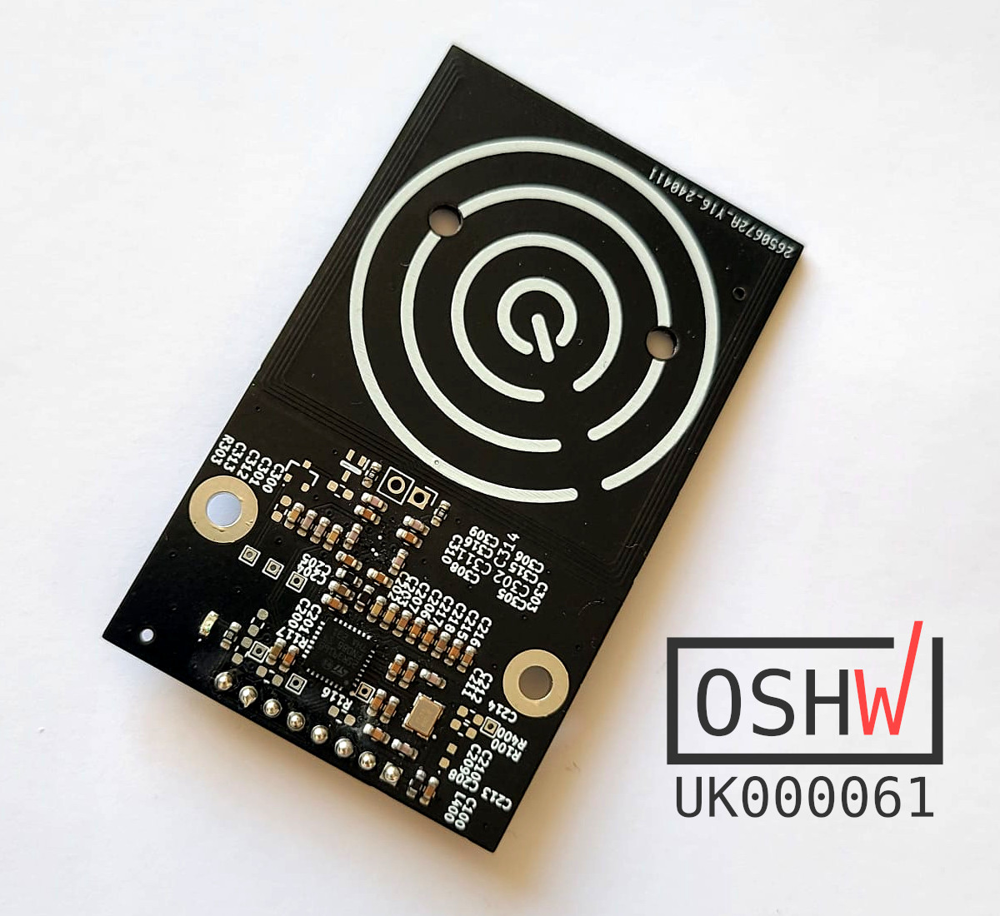

# Vicino NFC/RFID Board

An RFID/NFC reader using the ST Microelectronics ST25R3916B chip.  Hardware available [from the MCQN Ltd. shop](https://www.tindie.com/products/mcqn_ltd/vicino/).

For using the board see the [Examples.md](Examples.md) page.
